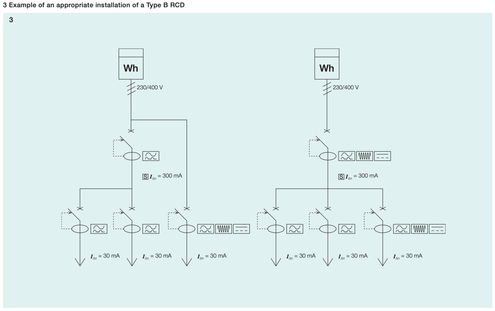
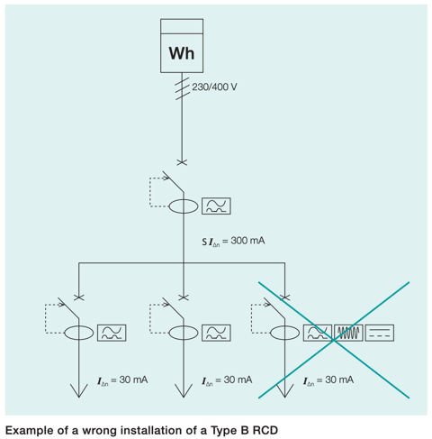

//:toc:
:toc-title: Innholdsfortegnelse
:toclevels: 5
:table-caption!:
:sectnums:
:sectnumlevels: 4

== Valg av jordfeilbryter
På noen nettsystemer er det krav til jordfeilbrytere på alle utgående kurser. Avhengig av type utstyr må vi velge jordfeilbryter basert på type utstyr for at jordfeilbrytere skal fungere. Dette gjelder særlig IT/TT systemer og frekvensomformere.

Sjekk brukermanualen til aktuell frekvensomformer før du velger jordfeilbryter. Videre må man ha kunnskap om hvordan norm som benyttes til prosjektering, og nettsystem som er på anlegget (IT/TT/TN).

== NEK 400
NEK 400 og IEC 60204-1 (maskindirektivet) kan benyttes for prosjektering av det elektriske anlegget. Begge disse standardene harmonerer mtp. valg av jordfeilbryter for nettsystem.

NEK 400 er lagt til grunn i denne beskrivelsen. Se nederst i dokumentet for krav satt i IEC 60204-1 (maskindirektivet).

Videre er dette bare et utsnitt av NEK 400, og andre krav og muligheter for installasjonen finnes. Dersom du er usikker så spør installasjonsavdeling. Veiledningen er ment for å gi noen pekepinner på best praksis. 

=== Beskyttelse mot elektrisk sjokk
Når man skal beskytte mot elektrisk sjokk (41) finnes det fire likestilte metoder for å oppnå dette

 1. - 411 - Automatisk utkobling av strømtilførselen (sikring/jordfeilbryter)
 2. - 412 - Dobbel eller forsterket isolasjon (klasse to utstyr)
 3. - 413 - Elektrisk adskillelse ved forsyning til èn utstyrsenhet (Egen trafo)
 4. - 414 - Ekstra lav spenning (SELV og PELV, eks 24V DC systemer)

Ved bruk av frekvensomformer er det ofte bare metode 1 som er aktuell (automatisk utkobling).

==== Automatisk utkobling (411)
Ved feil på isolasjon/avskjerming skal maksimal berøringsspenning normalt ikke overstige 50V AC.
Hvis denne verdien overskrides skal et vern automatisk koble ut strømtilførselen slik at den forhøyede
berøringsspenningen ikke blir stående for lenge. (NEK 400.411.1)

Ved automatisk utkobling skal vernet koble ut kursen ved feil (jordfeil) innenfor disse tidene.

.Tabell 41A
|=== 
| Utstyr | TN | IT | TN 
| Stikkontakt til og med 63A                    | 0,4 | 0,4 | 0,2 
| Stikkontakt over 63A                          | 5   | 5   | 1
| Fast tilkoblet forbruksapparat til og med 32A | 0,4 | 0,4 | 0,2
| Fast tilkoblet forbruksapparat over 32A       | 5   | 5   | 1
| Hovedkurser                                   | 5   | 5   | 1
|===

TIP: Iht. 41D kan en tilleggsutjevningsforbindelse (ekstra jording) iht. 415.2 benyttes til utstyrsenheten dersom utkoblingskravet ikke oppfylles iht. tabell 41A og 411.3.2. Utkoblingen må likevel være <5s for å tilfredsstille utkobling iht. blant annet 411.6.2.3.2 for IT anlegg og spenningen skal ikke overstige 50V AC eller 120V DC. 

== Krav jordfeilbryter nettsystemer

=== TN systemer (411.4)
Dersom automatisk utkobling benyttes er det normalt ikke krav om jordfeilbryter så lenge vern legger ut innen utkoblingstider iht. tabell 41A. Dersom utkoblingstiden ikke er tilstrekkelig er det nødvendig med tilleggsutjevningsforbindelse av utstyr. (415.2)

=== TT systemer (411.5)
Krav om jordfeilbryter eventuelt at impedansen i jordingen er tilstrekkelig lav slik at berøringsspenning holdes under <50V. Dette er vanskelig og dokumentere, så det anbefales jordfeilbryter eller å benytte en av de andre metodene (412...414)

=== IT systemer (411.6)
I utgangspunktet er det krav om jordfeilbryter på alle utgående kurser da jordfeilstrømmen er for lav til å
sikre automatisk utkobling ved vanlig automatsikring. Det kan derimot utelates jordfeilbryter for 1. utkobling dersom krav i NEK 400.6.2.3.3 er oppnådd. Videre er det ikke krav om størrelse eller forsinkelse på jordfeilbryter med unntak iht. liste under. <<Liste>>

Normalt har ikke anlegg godt nok internkontrollsystem eller kan dokumentere dette på en god måte. Det gjør at kravene ikke er oppfylt og NK må derfor levere anlegg med jordfeilbryter på alle utgående kurser for IT-anlegg.

Dersom det velges jordfeilbryter større enn 30mA bør det vurderes at lekkasjestrømmer er store nok til å legge ut jordfeilbryter. Den minste feilstrømmen vi kan forvente ved første jordfeil er ca. 0,5mA per KVA ytelse av forsyningstransformatoren. Ved valg av 300mA jordfeilbryter må trafo derfor være minst **600 KVA**!

==== Allment forsynt nett (411.6.2)
Gjelder anlegg som ikke har egen trafo. (Små anlegg)

Alle forbrukerkurser skal beskyttes med automatisk utkobling ved å tilfredsstille 1 av 3 krav nedenfor: 

1. Kursen kobler ut iht. tidene i tabell 41A. Det stilles ikke krav til størrelse på jordfeilvern.
2. I små transformatorkretser kan kapasitansene være så små at selv 30mA vil være for stor
3. beskyttes iht. 411.6.2.3.2 eller 411.6.2.3.3

===== Utkobling 5 sekunder - 411.6.2.3.2
Dersom utkoblingstidene ikke kan oppfylles og kursen ikke forsyner utstyr i BA2 områder, skal enhver jordfeil kobles ut innenfor 5 sekunder. (ikke krav om størrelse på jordfeilvern)

===== Overvåkning - 4111.6.2.3.3 
Dersom utkobling av utstyr vil skape alvorlige driftsmessige problemer kan utkobling ivaretas ved

1. Utstyret ikke er i et BA2 område og
1. Kursen overvåkes i samsvar med avsnitt 411.6.6 (hørbart/synlig signal) og
1. kursen/anlegget er omfattet av et **internkontollsystem** og
1. Kursen er beskyttet av et vern som sikrer utkobling ved 2. jordfeil

==== Installasjoner galvanisk adskilt fra allment IT-nett (411.6.3)
Gjelder anlegg som har egen trafo (store industrianlegg)

1. Være omfattet av et **internkontrollsystem**
1. Berøringsspenningen ved 1. jordeil skal være <50VAC
1. Kursen være isolasjonsovervåket
1. Utkobling skal skje ved jordfeil no. 2 på separat fase

//==== Installasjoner der 411.3.2 ikke er anvendbart (41D.2)
//For installasjoner med kraftelektroniske omformere med nominell spenning U0 > 50V AC eller 120V DC og hvor automatisk utkobling av strømtilførselen ikke er hensiktsmessig, skal utgangsspeningen til strømkilden bli redusert til 50V AC eller 120V DC eller mindre innen de tider som er spesifisert i 411.3.2.2, 411.3.2.3 eller 411.2.3.4 ved en feil mellom spenningsførende leder og beskyttelseslederen eller jord.

=== Utstyr som krever 30mA jordfeilbryter.
Denne listen inneholder utstyr som skal ha 30mA jordfeilbryter uavhengig av nettsystem.

.Liste
[%collapsible]
====
1. 411 Stikkontakter med merkestrøm til og med 20A beregnet for bruk av ikke-sakkyndige personer, og utendørs stikkontakter
og flyttbart utstyr til og med 32A
1. 422 Beskyttelse mot brann i områder hvor ytre påvirkninger medfører særlig risiko for og ved brann
1. 551 Strømforsyningsenheter for lavspenning
1. 559 Belysningsinstallasjoner
1. 714 Utendørs belysningsinstallasjoner
1. 753 Varmekabler og skjulte oppvasmingssystemer
1. Se ellers NEK 400, listen er **IKKE** komplett
====

== Typer jordfeilbrytere
[cols="10%,20%,30%,25%,15%"]
|===
|**RCD type** |**Sensitivitet mot** |**Egenskaper** |**Utstyr** |**Standarder**

| A
| Vekslende og pulserende likestrøm
| Sinusformet AC og pulserende DC opptil 6 mA
| * Kaffemaskiner +
 * Strykejern +
 * Varmepærer +
 * Brødristere +
 * Elektriske enheter til oppvarming +
|IEC EN/ 61009

| AC
| 
| 
| ** Ikke tillatt i Norge!**
| 

| B
| Vekselstrøm og pulserende likestrøm og flat likestrøm
| Alle strømmer opp mot 1 kHz
| * Frekvensomformere (Ikke Eaton) +
  * Ebilladere +
  * Solcelleanlegg +
| IEC / TR 60755+IEC / EN 62423

| B+ (Eaton)
| Vekselstrøm og pulserende likestrøm og flat likestrøm
| Alle strømmer opp mot 20 kHz
|
| VDE 0664-440

| Bfq (Eaton)
| Vekselstrøm og pulserende likestrøm og flat likestrøm
| Alle strømmer opp mot 50 kHz
|
| IEC / EN 62423

| F
| Vekslende og pulserende likestrøm
| Sinusformet AC og pulserende DC opptil 10mA.
 Jordfeilautomater av type F er spesifikt utformet for **en-fase frekvensdrifter**.
| * vaskemaskiner +
* oppvaskmaskiner +
* varmepumper +
* ventilasjonsapplikasjoner +
* klimaanleggsystemer +
* sveiseutstyr +
* kjøleskap +
* mikrobølgeovner +
|IEC EN/ 61009

|G
|
| Tidsforsinket på minimum 10s. Benyttes på vern A-F som tilleggsegenskap
|
|

|S
|
| Selektivt jordfeilvern. 40...50ms. For å oppnå selektivitet må man i tillegg til tidsforsinkelse velge et med utløsestrøm som er 3 ganger større enn det etterfølgende vernet.
|
|

|===

=== Eaton jordfeilautomater for frekvensomformere

Eaton sin veiledning påpeker at ved 1-fas frekvensomformer skal type F benyttes.
Ved 3-fas frekvensomformer skal type Bfq benyttes.

=== ABB jordfeilautomater for frekvensomformere
ABB som veiledning krever at det benyttes type F ved 1-fas frekvensomformere.
Ved 3-fas frekvensomformere skal type B benyttes (F202)

TIP: ABB jordfeilbrytere må ha motstand montert mellom 4/3 og 8/7/N ved 400V uten N! Se brukermanual 

=== Schneider jordfeilautomater for frekvensomformere

Schneider anbefaler type B for frekvensomformere. Forskjellen på B og B-si er at Si er mer imun mot støy.

== Koordinering vern

TIP: Husk at oppstrøms vern må koordinere med nedstrøms vern. Dersom du benytter type B vern, må vern forran dette også være type B.

== Tabell jordfeilbrytere type B
Anbefalte jordfeilbrytere er satt i **fet skrift** basert på pris/leveringstid pr. Juli 2024.
Dette gjelder for frekvensomformere.

link:./jordfeilbrytere.xlsx[Hent fil]

== TLDR - Hva gjør jeg? 

Ved TN nett (400V + N) ikke benytt jordfeilbryter. Automatsikring er ofte god nok 
Ved IT/TT nett (230V uten N) benytt jordfeilbryter iht. tabell over for frekvensomformer.
For 1-fase frekvensomformere benytt type F jordfeilautomat, for alt annet bruk type A. 

== ABB frekvensomformere tips

1. ABB frekvensomformere må ha jordfeilbryter større enn 30mA grunner lekkasjestrømmer til jord
2. På IT-nett må det også huskes og fjerne skrue for EMC for å få ned jordfeilstrøm. Se aktuell 
brukermanual for omformer.

== IEC 60204-1 (maskindirektivet)
Dersom anlegget skal godkjennes iht. IEC 60204-1 (maskindirektivet) så gjelder følgende krav:
6.3.1 i maskindirektivet beskriver at beskyttelse ved feil kan oppfylles ved: +
 - Tiltak for å forhindre at berøringsspenninger oppstår (6.3.2) eller +
 - automatisk utkobling av strømtilførselen før kontakt med en berøringsspenning kan blir farlig (6.3.3) (jordfeilbryter)

Disse harmonerer med NEK 400, og dersom denne legges til grunn vil anlegget være godkjent.

=== 6.3.2 Tiltak for å forhindre at det oppstår en farlig berøringsspenning
Følgende tiltak kan benyttes for å forhindre at det oppstår en farlig berøringsspenning

1. Beskyttelse ved bruk av utstyr klasse 2 (dobbel isolasjon)
2. Beskyttelse ved elektrisk adskillelse (trafo)

=== 6.3.3 Beskyttelse ved automatisk utkobling av strømtilførselen
Skal koordineres iht. annex A mtp. utkoblingstider. I utgangspunktet gjelder samme krav som i NEK 400.

TIP: IEC EN 60204-1:2018 A.4.1: "Når det benyttes en PDS (frekvensomformer) skal utkoblingstiden for beskyttelse ved feil tilfredsstille
de relevante kravene i Tillegg A ved at de innkommende forsyningsterminalene til kraftelektronikkmodulen (BDM) til
omformeren."e

== Leseliste
[%hardbreaks]
https://www.eaton.com/content/dam/eaton/products/electrical-circuit-protection/circuit-breakers/xeffect-rccb/eaton-rcd-application-guide-br019003en-en-us.pdf[Eaton Residual Current Devices Application guide]
https://www.eaton.com/content/dam/eaton/markets/residential/safe-smart-energy-efficient-homes/brosjyre-jordfeilautomater-og-afdd.pdf[Vern brosjyre Eaton]
https://www.eaton.com/content/dam/eaton/products/electrical-circuit-protection/circuit-breakers/xeffect/eaton-pdd-frcdm-catalog.pdf[Vern brosjyre Eaton]
https://resources.news.e.abb.com/attachments/published/47654/nb-NO/68DB99F34DDA/2CSC423015B0201-Brochure-F200-B-EN-web-April-2015.pdf[ABB jordfeilbrytere]
https://resources.news.e.abb.com/attachments/published/47654/nb-NO/68DB99F34DDA/2CSC423015B0201-Brochure-F200-B-EN-web-April-2015.pdf[ABB type B jordfeilbrytere]
https://www.se.com/no/no/product-range/7559-jordfeilbrytere-acti-9-iid-rccb/?parent-subcategory-id=1620&filter=business-4-elektrisk-distribusjon&N=brand%3Dse%26country-code%3DNO%26language-code%3Dno%26ats_eleakage_prot_class%5B%5D%3DType%2BB-EV%2B%2528Electric%2BVehicle%2529%26ats_eleakage_prot_class%5B%5D%3DType%2BB-SI%2B%2528Super%2BImmunised%2529%26ats_poles_description%5B%5D%3D4P&selected-node-id=12144438694[Schneider jordfeilbrytere] +
https://download.schneider-electric.com/files?p_enDocType=Catalog&p_File_Name=LVCATM9OEM_EN+%28web%29.pdf&p_Doc_Ref=LVCATM9OEM_EN[Schneider katalog]