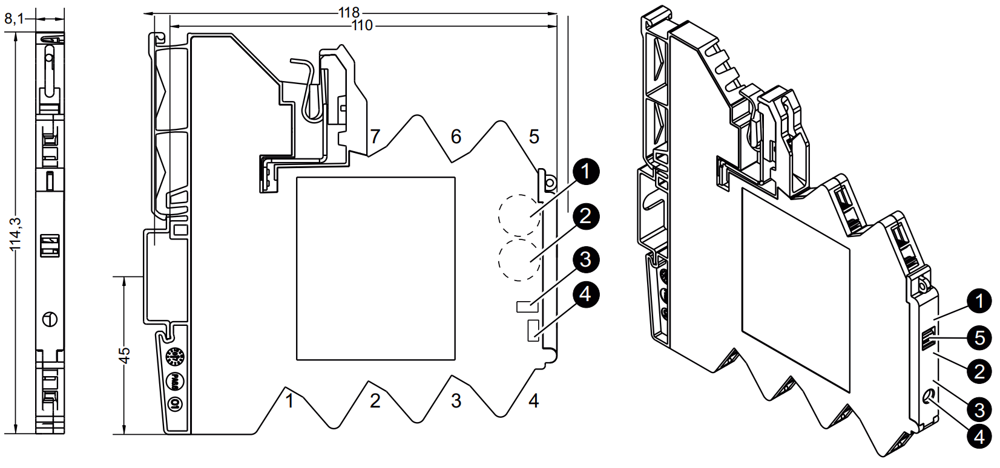
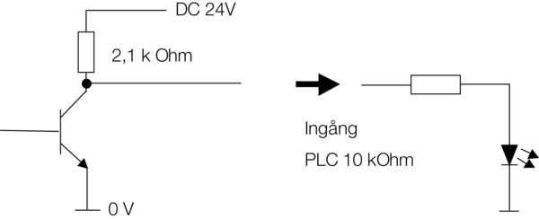
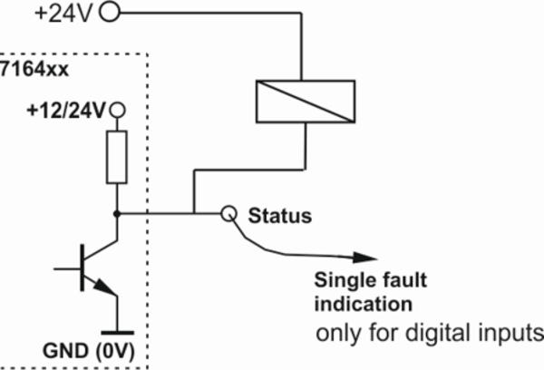
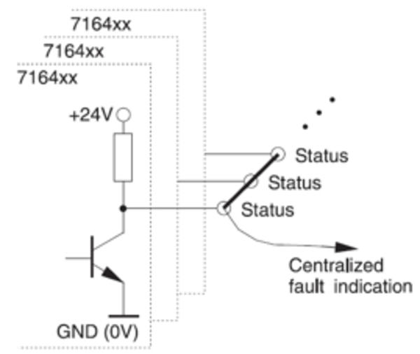
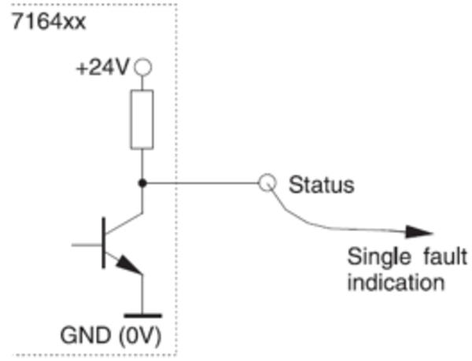

//:toc:
:toc-title: Innholdsfortegnelse
:toclevels: 5
:table-caption!:
//:sectnums:
//:sectnumlevels: 4

= Elektroniske sikringer

== Lysindikering

[%header]
|===
| Lysindikering         | Utgang    | Beskrivelse 
| Grønt lys             | PÅ        | Alt OK (1)
| Grønt lys blinker 1Hz | Overlast  | Last over 90% av In 
| Grønt lys blinker 5Hz | Overlast  | Last over 100% av In
|                       |           | 
| Rødt lys              | AV        | Utgang slått av eller kvittert (1) 
| Rødt lys blinker 1Hz  | Overlast  | Utgang av grunnet overlast eller kortslutning 
| Rødt lys blinker 5Hz  | Error     | Koblingfeil / intern feil
| Rødt lys blinker sakte| AV        | Utgang avslått fra ekstern set/reset knapp  

|===

1. Hvis driftsspenningen blir slått av, lagres den siste statusen (Standard).

== Betjening

 . Vrihjul for justering av strøm (a)
 . Vrihjul for justering av karakterstikk (a)
 . LED
 . Bryter for AV/PÅ (b)
 . Klikk på merkeholder

//- 

[loweralpha]
. Avhenger av produkttype. Innstillinger lagres ved å slå av/på sikring igjen via bryter (4) og ikke via inngang for SET/RESET

. Dersom du slår av sikring kan du kun slå på sikring igjen ved å benytte bryter og ikke inngang for SET/RESET

== Justering av strøm

**Vrihjul for strøm**

Strømmen kan innstilles fra 0,2 til 2 A i 200 mA trinn for 0.2 - 2A brytere

For 1-10A brytere justeres dem i 1A trinn. 

**Vrihjul for karakterestikk**
 
. Rask
. Normal
. Treg-1 
. Treg-2
. Treg-3 

 Se brukermanual for kurver. 

== Signalutgang

Signalutgangen er av open collector typen med Pull-up motstand. Med denne teknikken kan man bygge sammen grupper og få alarme om en sikring i gruppen løser ut. Avhengig av den ytre lastresistansenkan utspenningen ved ikke utløst sikring variere.

**24 Kobling med rele** + 

Med en reléspole som ofte er lavohmig skal tilkobles direkte til alarmutgangen skal +24 V DC kobles direkte til reléet, minus skal kobles til alarmutgangen. OBS! Man får invertert funksjon, når sikringen ikke signaliserer feil er reléet ikke påvirket, ved feil aktiveres reléet. Benytt f.eks 760020.1000,

**Sikring mot PLS inngang** 

10 stk sikringer er koblet. sammen i en gruppe med en feller alarmutgang til en PLS inngang på 10kΩ. Utsignalet på alarmutgangen ved driftstatus er 23,5 V DC. Alarmutgangens interne resistans er 2,1 kΩ. 2,1 kΩ/10=210 Ω. Re/ Rtot*U = 10 kΩ/10,21 kΩ*24=23,5 V DC.

**Enkelt sikring** 

Eks 1. Kun 1 stk sikring benyttes, alarmutgangen er koblet til en PLS inngang på 10 kΩ. Utsignalet på alarmutgnagen ved driftstatus er 19,8 V DC. Alarmutgangens interne resistans er 2,1 kΩ. Re/ Rtot*U= 10 kΩ/12,1 kΩ*24=19,8 V). 